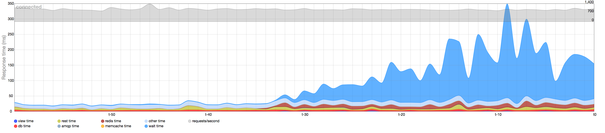
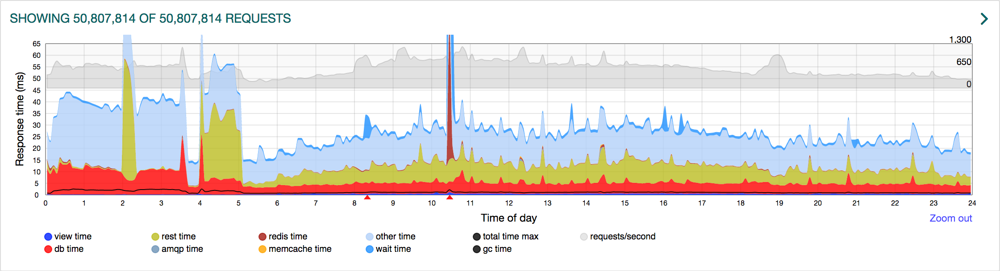

build-lists: true
text: #ffffff
list: #ffffff, bullet-character( )
text-emphasis: #f74048
header: #f74048

[.header: #ffffff]


# Find unused code

---

## Who am I?

* Nils Gemeinhardt
* Developer at XING Events
* Love to cleanup code

---


Luckily nobody knows that I've removed more then I added :smiley:

---

## Why *keeping* unused code?

* already written / tested
* maybe used in the future
* removing can lead to problems

---

## Why *removing* unused code?


* *no hard feelings if "your code" is removed*
* more maintenance afford
* re-using code is unlikely
* have to understand unused code

* you have version control

^ e.g. on rails updates

^ you can't predict the future - "You aren't gonna need it" principle

---

## The project

2.600 files with 70k lines of ruby
developed in over 11 years
by 200 contributors

*Features come and go, but the code may stay.*

---

## Traceroute


---

## Traceroute

"A Rake task that helps you find dead routes and unused actions"

[github.com/amatsuda/traceroute](https://github.com/amatsuda/traceroute)


---

## Traceroute - Output

```bash
Unused routes (22):
  /events/browse/featured(.:format)
  /rest/events/apidoc/rest(.:format)
  /rest/events/apidoc/vendor(.:format)
  /:seo_country/events/countries(.:format)
  /:seo_country/events/online_events(.:format)
  external#none

Unreachable action methods (402):
  xing/vendor_api/documentation#show
  rest/events#organizer_type
  rest/events#for_time
  rest/events#for_event
  rest/events#for_rid
  qunit#js_test_files
  amiando#event_element
  amiando#assets_locale

```

---

# Traceroute - Result

Unused routes (47)
Unreachable action methods (2957)

*The numbers look like a bug, but actually Traceroute is right..* :neutral_face:

---

## Traceroute - Unreachable action methods

* gems - *whitelisting*
* public method in concerns - *bad practices*
* public non-action methods - *bad practices*
* including helpers - *bad practices*
* Unused code - *cleanup*

^ Only actions should be public methods

^ Having a public method in the base class or an concern will count in several times

---

## Traceroute - Unused routes

false positive on action with only a view - workaround: empty method

```ruby
Class EventsController < FrontendController
  def edit; end # keep for traceroute
end
```

false positive on

```ruby
get 'browse/featured', to: proc { [410, {}, ['']] }
```

---

## Traceroute - Whitelisting

you can whitelist routes / action that should be ignored

*Careful:* Ignoring full controllers in "Unreachable action" will get them reported in "Unused routes".

---

## Traceroute - Conclusion

*Setup is easy*, but a long list can take hours.

Nice to find *unused routes* and find *code smells* in your controllers.

^ Was surprised how many unused actions / routes we had

---


[.footer: don't google for pictures about debride]

# debride

---

## debride

"Static analysis of code for potentially uncalled / dead methods"

[github.com/seattlerb/debride](https://github.com/seattlerb/debride)

---

## debride - Output


```bash
These methods MIGHT not be called:

ActiveForm
  human_attribute_name                ./lib/active_form.rb:80-81
  human_name                          ./lib/active_form.rb:76-77
  instantiate                         ./lib/active_form.rb:65-68
  method_missing                      ./lib/active_form.rb:24-31
  self_and_descendants_from_active_record ./lib/active_form.rb:72-73

ActiveModel::Errors
  add_with_xing_translation           ./lib/rails_ext/active_record/validations.rb:30-47

Add3072FieldsToEvents
  down                                ./db/migrate/20131016124818_add3072_fields_to_events.rb:12-18
  up                                  ./db/migrate/20131016124818_add3072_fields_to_events.rb:2-10
```

---

## debride

* quick and easy to setup
* produces a long list of *potential* unused methods
* with extension e.g. for `haml` or `erb`


---

## debride - whitelisting

includes controller actions by default:
can generate whitelisting based on routes and production log

exclude migration methods (`up`, `down`)

---

## debride - problems


```ruby
prepend_before_action :my_function
```

```ruby
def add_with_path; end
alias add add_with_patch
```

```ruby
attr_accessor :my_property # model
form.radio_button :my_property # view
```

```ruby
user&.within_group?(group)

```

^ &. = Safe navigation operator 

---

## debride

Really helpful to use only `attr_writer` or `attr_reader` instead of `attr_accessor` and to spot unused constants.

*Attention:* debride does not find a method if there are specs for, so you need to exclude the specs folder.

---

## debride

*always double check the list!*

```ruby
def events
  send(%w[my events].join('_'))
end
```

Use `git grep` and also check the git history

^ not only for decried

---


# Zombie Scout

---

[.footer: last commit: > 1 year ago]

## Zombie Scout

"It parses your code to find method declarations, and then greps through your project's source, looking for each method."

[github.com/danbernier/zombie_scout](https://github.com/danbernier/zombie_scout)

---

## Zombie Scout - Output


```bash
Scouted 4250 methods in 811 files, in 118.8048 seconds.
Found 105 potential zombies, with a combined flog score of 185.4.


app/controllers/application_controller.rb:92	ApplicationController#handle_unverified_request	2.2
app/controllers/application_controller.rb:109	ApplicationController#process_action	1.1
app/controllers/backend_controller.rb:68	BackendController#load_user_from_session	9.2
app/controllers/rest/events_controller.rb:125	Rest::EventsController#active_model_errors	10.7
app/controllers/rest/rest_controller.rb:21	Rest::RestController#collection_to_render	8.1
app/controllers/rest/vendor/mobile/base_controller.rb:19	BaseController#consumer_salt	0.0
app/helpers/application_helper.rb:53	ApplicationHelper#canonical_link	2.2
app/helpers/form_element_helper.rb:51	FormElementHelper#error_message_on_with_span_tag	3.8
app/models/amiando/billing.rb:40	Amiando::Billing#complete_billing_address?	4.7

```

---

## Zombie Scout

Similar to debride, but with less "noise" / setup needed.
But also less results (e.g. constants).

Also found code that was there only for testing - *bad practice*.

---


# unused


---

## unused

"A command line tool to identify unused code."

[github.com/joshuaclayton/unused](https://github.com/joshuaclayton/unused)

---

## unused - Output

```bash
app/controllers
     Localrun                   app/controllers/localrun/login_controller.rb               occurs once
     SitemapSupport             app/controllers/rest/sitemap_support/events_controller.rb  only the definition and corresponding tests exist
     TestSupport                app/controllers/test_support/database_reset_controller.rb  only the definition and corresponding tests exist
     active_model_errors        app/controllers/rest/events_controller.rb                  occurs once
     collection_to_render       app/controllers/rest/rest_controller.rb                    occurs once
     handle_unverified_request  app/controllers/application_controller.rb                  occurs once
     load_user_from_session     app/controllers/backend_controller.rb                      only the definition and corresponding tests exist
     process_action             app/controllers/application_controller.rb                  occurs once

```

---

## unused - Mistakes

(non-standard) routing

```
namespace :search_support, path: 'searchsupport' do
  get 'event_ids'  => 'events#event_ids'
end

post 'events/test_support/dump' => 'test_support/database_reset#dump' 
```

overwittting method

---

## unused

* No configuration needed
* Nice output
* Results are more or less like in the other tools

---

## rails best practices


---

## rails best practices

"a code metric tool to check the quality of Rails code"

[https://github.com/flyerhzm/rails_ best _practices](https://github.com/flyerhzm/rails_best_practices)

---

## rails best practices

Provide hints to

* Move code from Controller to Model
* RESTful Conventions
* Remove empty helpers
* ...
* Find unused code

---

## rails best practice - Output

```bash
/app/controllers/application_controller.rb:92 - remove unused methods (ApplicationController#handle_unverified_request)
/app/controllers/application_controller.rb:109 - remove unused methods (ApplicationController#process_action)
/app/controllers/application_controller.rb:183 - remove unused methods (ApplicationController#module_name)
/app/controllers/application_controller.rb:198 - remove unused methods (ApplicationController#abort)
/app/controllers/backend_controller.rb:52 - remove unused methods (BackendController#check_admin_subdomain)
/app/controllers/backend_controller.rb:68 - remove unused methods (BackendController#load_user_from_session)
/app/controllers/events_controller.rb:273 - remove unused methods (EventsController#dismiss_for_event)
/app/controllers/events_controller.rb:279 - remove unused methods (EventsController#dismiss_for_all)
/app/controllers/admin/advertisements_controller.rb:89 - remove unused methods (Admin::AdvertisementsController#set_advertisement)
/app/controllers/people_to_meet_controller.rb:60 - remove unused methods (PeopleToMeetController#dismiss_user)
/app/controllers/frontend_controller.rb:116 - remove unused methods (FrontendController#handle_reklame)
```

---

## rails best practice

* No configuration needed
* Good results
* Also a lot of "noise"
* Same problems as for unused

^ not only doing unused methods


---


# Coverband

---

## Coverband

"A gem to measure production code usage, showing each line of code that is executed."

[github.com/danmayer/coverband](https://github.com/danmayer/coverband)

---

## Coverband

* Rake middleware
* Redis or file storage

---

## Coverband - baseline

* "Baseline is app initialization coverage, not captured during runtime."

^ the baseline is important because some code is executed during app load, think prefetching, initial cache builds, setting constants

^ it covers what it hit during run time

---

## Coverband - coverage drift

* theoretically clear coverage on every deploy
* no useful data: outdated or too short time - *tradeoff*
* best case: clearing only after big code changes

---

## Coverband

* small afford to setup
* (feels) "risky" since running in production
* most reliable results
* looked good in preview

---

## Coverband

_The performance impact was too big_ 😟



---

## Coverband



*Big spike on Redis* - maybe a different storage?

---


# Flatfoot

---

## Flatfoot

[.footer: last commit: > 4 years ago]

"track unused views in your application"

[github.com/livingsocial/flatfoot](https://github.com/livingsocial/flatfoot)

---

## Flatfoot

uses `ActiveSupport::Notifications.subscribe`
initialised with list of all views

browse your app: list of (un)used views

---

## Flatfoot

* big list of views
* maybe usable on production
* potential for gamification

^ 360 files in our app

---


# Code Coverage

---

# Code Coverage

* precondition: good code coverage quote
* check untested code
* may be old / forgotten code

^ 87% Code Coverage

---


# Summary

---

## Summary

* many tools out there
* no easy way - wroth the effort
* good chance to learn your code
* domino effect: e.g. unused action → view → method

---


# Thank You

## Questions?

<!--

---

## Links

* https://infinum.co/the-capsized-eight/top-8-tools-for-ruby-on-rails-code-optimization-and-cleanup
* https://kevinjalbert.com/find-and-bury-dead-code/
* https://stackoverflow.com/questions/15699995/why-unused-code-should-be-deleted

---

## Other tools

* [github.com/michaelfeathers/scythe](https://github.com/michaelfeathers/scythe)


-->